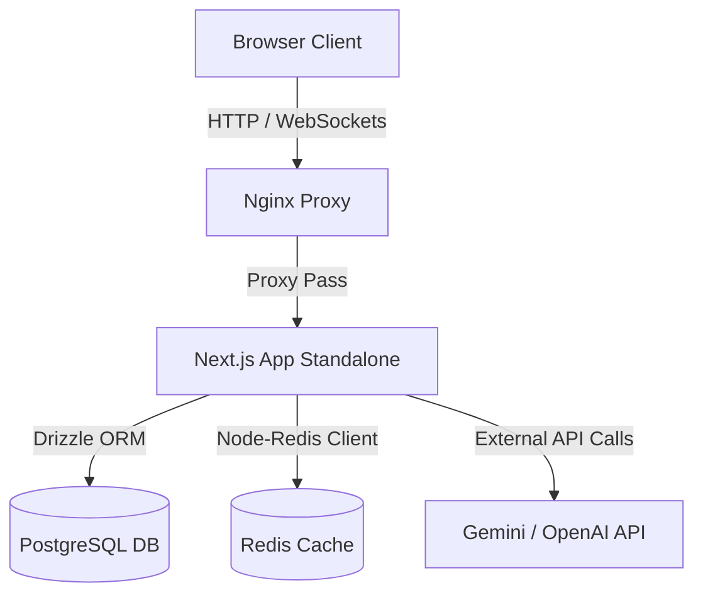
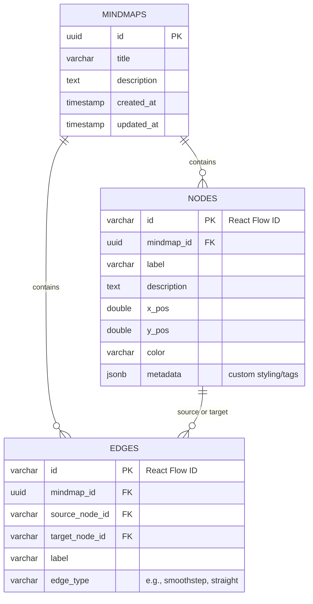

# Design & Architecture: k-mind

This document outlines the technical design, data schemas, software architecture, and docker topology for the `k-mind` mindmap builder.

---

## 1. System Architecture

`k-mind` is a containerized web application built on Next.js, backed by PostgreSQL for persistence and Redis for caching.



---

## 2. Database Schema (Postgres + Drizzle)

The database models a directed graph representing mindmaps. Because nodes can be multi-linked (i.e. have multiple parent nodes), we store nodes and edges in separate normalized tables rather than a simple tree structure.



### Drizzle Schema Definition draft:
```typescript
import { pgTable, uuid, text, doublePrecision, timestamp, varchar, jsonb } from 'drizzle-orm/pg-core';

export const mindmaps = pgTable('mindmaps', {
  id: uuid('id').defaultRandom().primaryKey(),
  title: text('title').notNull(),
  description: text('description'),
  createdAt: timestamp('created_at').defaultNow().notNull(),
  updatedAt: timestamp('updated_at').defaultNow().notNull(),
});

export const nodes = pgTable('nodes', {
  id: varchar('id', { length: 255 }).primaryKey(), // React Flow node id
  mindmapId: uuid('mindmap_id').references(() => mindmaps.id, { onDelete: 'cascade' }).notNull(),
  label: text('label').notNull(),
  description: text('description'),
  xPos: doublePrecision('x_pos').notNull(),
  yPos: doublePrecision('y_pos').notNull(),
  color: varchar('color', { length: 50 }),
  metadata: jsonb('metadata').default({}),
});

export const edges = pgTable('edges', {
  id: varchar('id', { length: 255 }).primaryKey(), // React Flow edge id
  mindmapId: uuid('mindmap_id').references(() => mindmaps.id, { onDelete: 'cascade' }).notNull(),
  sourceNodeId: varchar('source_node_id', { length: 255 }).references(() => nodes.id, { onDelete: 'cascade' }).notNull(),
  targetNodeId: varchar('target_node_id', { length: 255 }).references(() => nodes.id, { onDelete: 'cascade' }).notNull(),
  label: varchar('label', { length: 255 }),
  edgeType: varchar('edge_type', { length: 50 }).default('smoothstep'),
});
```

---

## 3. Frontend Architecture (React Flow Canvas)

We use **React Flow** (`@xyflow/react`) to manage the interactive workspace.

### Core Canvas Components
- **`MindmapCanvas`**: Hosts the `<ReactFlow>` renderer.
  - Custom nodes: `SkillNode` (supports color coding, status badges, multi-parent connection anchors).
  - Custom edges: `SkillEdge` (supports connection labels, delete buttons on hover).
- **`Sidebar`**:
  - Displays editing forms for the selected Node (change label, notes, type, color).
  - Displays the AI recommendation panel.
- **`Toolbar`**: Floating control bar for save, load, export, import, auto-layout, zoom controls.

### State Management
State is managed locally in Next.js React state (or optional light store like Zustand) synced to the canvas:
- `nodes`: list of active node models.
- `edges`: list of active edge models.
- `onConnect`: handles validation checks (e.g. cycle check, connection limits) when a user draws a new line.

---

## 4. AI Suggestion Endpoint Design

The AI Suggestion route `POST /api/ai/suggest` returns contextual expansions for a given concept.

### Request Body Schema:
```json
{
  "nodeLabel": "Docker Compose",
  "category": "child", // or "parent" or "sibling"
  "context": {
    "parentNodes": ["Docker", "Containerization"],
    "siblingNodes": ["Dockerfile", "Docker Swarm"],
    "description": "Orchestrating multi-container applications."
  }
}
```

### Prompt Engineering Strategy:
- **Child Skills**: "Suggest 5 granular, practical sub-skills or tools related to '{nodeLabel}'. Focus on actionable developer concepts. Return only a valid JSON array of strings."
- **Parent Skills**: "Identify 3 foundational prerequisite topics or broader categories that someone must understand before learning '{nodeLabel}'."
- **Sibling Skills**: "List 4 related but non-overlapping technologies or concepts at the same level of difficulty/abstraction as '{nodeLabel}' within the domain of '{parentNodes}'."

### Redis Caching Layout:
- Cache Key: `ai:suggest:${nodeLabel}:${category}:${md5(context)}`
- TTL: 604800 seconds (7 days).
- Hits retrieve suggestion lists directly, bypassing LLM invocation.

---

## 5. Docker Topology & Orchestration

The application runs in 4 containers defined in `docker-compose.yml`:

1. **`nginx`**: Port `80` (external) proxies requests to port `3000` inside `nextjs-app`.
2. **`nextjs-app`**: Runs the production built Next.js application in standalone Node.js server mode.
3. **`postgres`**: Exposes port `5432` internally. Uses a named docker volume `postgres_data` for data persistence.
4. **`redis`**: Exposes port `6379` internally. Uses `redis_data` volume for persistence.
