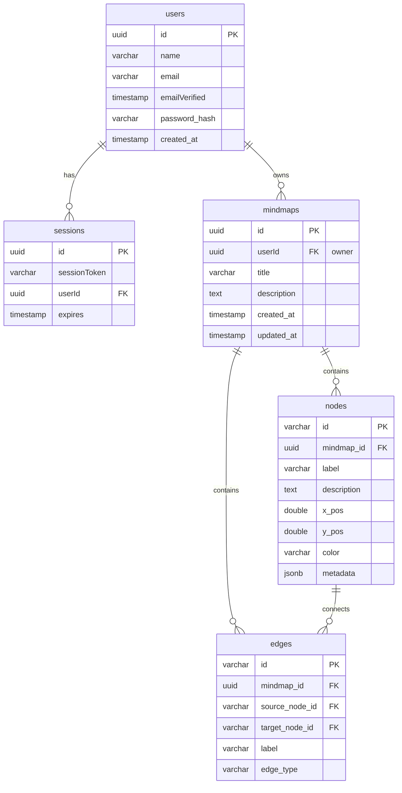

# Design Specification: Production-Ready k-mind

This document outlines the end-to-end design for the production-ready `k-mind` mapping application, including authentication, the marketing site, the AI suggestion engine, database schema, data portability, and verification strategies.

---

## 1. System Architecture & Tech Stack

We use a consolidated **Monorepo Next.js App Router** design for maximum velocity and clean code sharing:

- **Frontend**: Next.js 16 (App Router), React 19, Tailwind CSS.
- **Interactive Canvas**: React Flow (`@xyflow/react`) for graph nodes and edges.
- **Routing Structure**:
  - `(marketing)` group: Public-facing routes (`/`, `/pricing`, `/login`, `/register`).
  - `(app)` group: Authenticated workspace (`/dashboard`, `/map/[id]`).
- **Database**: PostgreSQL (pg) using **Drizzle ORM** for schema definition, migrations, and query building.
- **Session & Auth**: **Auth.js** (NextAuth v5) using credentials provider (email/password) storing credentials securely in PostgreSQL via bcrypt hashing.
- **Cache & Rate-Limit**: Redis container.
- **Reverse Proxy**: Nginx container handling traffic routing and SSL termination.

---

## 2. Database Schema (Extended with Auth)

---

## 3. Marketing Site & Authentication Layout

### 3.1 Marketing Route Group `app/(marketing)`
- **`layout.tsx`**: Public header (logo, links to features/pricing, login button) and footer.
- **`page.tsx`**: Landing page featuring a hero section with a rendered mock canvas image, a pricing grid, and FAQs.
- **`login/page.tsx` & `register/page.tsx`**: Standard forms built with Tailwind, validated with Zod schemas.

### 3.2 Main App Route Group `app/(app)`
- **`layout.tsx`**: Authed layout checking `auth()` session. Redirects to `/login` if unauthenticated. Renders sidebar with saved maps, user profile, and sign-out button.
- **`dashboard/page.tsx`**: Grid listing user's saved maps, template options, and a "Create New Map" button.
- **`map/[id]/page.tsx`**: Full-screen canvas workspace containing the node drawer, AI panel, and serialization controls.

---

## 4. Canvas & Interactive Workspace
- **Node Component (`SkillNode`)**: Displays titles, description snippets, tags, and state indicators. Outfitted with multiple connection handles.
- **Edge Component (`SkillEdge`)**: Straight or smoothstep curves containing a hoverable delete icon.
- **Auto-layout (Dagre wrapper)**: Re-calculates node coordinates based on hierarchy depth.
- **Data Serialization Adapters**:
  - **OPML Adapter**: Linearizes directed graphs into tree outlines using depth-first search, duplicating multi-parent nodes under respective parent nodes with reference flags.
  - **FreeMind Adapter**: Encodes the same linearized tree into FreeMind's `.mm` XML format.
  - **JSON Adapter**: Standard JSON containing exact node coordinates, multi-parent relationships, and custom metadata.

---

## 5. Caching, Rate-Limiting & AI Suggestion Engine
- Endpoint `/api/ai/suggest` queries Gemini (or OpenAI) API.
- Prompt templates define context (current concept name, parent nodes, sibling nodes).
- **Redis Cache Layer**: Bypasses AI queries for already expanded nodes using a cache key matching `ai:suggest:<label>:<type>`.
- **IP Rate-Limiting**: Prevents API key exhaustion by caching IP hit counters with a 60-second sliding window.

---

## 6. Testing & Quality Assurance
- **Unit Tests**: Built using **Vitest** for testing serialization adapters (`OPML`, `.mm` XML, `JSON` parsers) and input schema validation helpers.
- **Integration Tests**: Tests database CRUD operations and server action authorization checks.
- **E2E Tests**: Standard automated UI flow checking login, map creation, node placement, and saving.
